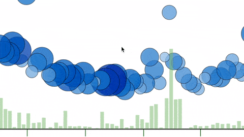

# Visualizing my running data.  

Datasource is pulled from Strava's API

### Zooming out, 'bubbles' the runs into larger bubbles.
Bubbling runs together is dependent on a threshold variable.  The threshold is the number of days that runs will bubble into.  For
example, if we set the threshold to 7, then all runs that fall within a 7 day moving window, will bubbled together.

### Zooming in, 'pops' the bubbles into smaller bubbles.

Similar to zooming out, if the bubbles within bubbles fall under the threshold, then we 'pop' the bubble, and rebubble with the new threshold.

The threshold is set dynamically by the zoom level.

## Now the complicated...

Start position is defined as where the bubble will be drawn at the start and animate to its self position, which is defined by the date (x-pos) and pace (y-axis).

Self position is defined by where the bubble will animate to, as its destination FROM the start position.  It is defined by the date (x-pos) and pace (y-axis).

End position is defined as where the bubble will exit / be destroyed from the user's view.  This is the resting place when D3.js calls exit().

It is best to think of the pop and bubbling positions as very closely knit together, rather than separate processes.  Both pop and bubble is called every time the zoom changes.  When zoom changes, threshold changes.

### Pop start and end positions
If under the threshold, start position is set to the parent bubble's position.  The bubble will then animate to the self position.

### Bubbling start and end positions

If the the bubble's in comparison are less than the threshold (indicating that they are to be bubbled), then we set the end position to the parent's position.  This mean that they are to die once they are bubbled to the parent.

Starting position is set to self position, if the bubble being bubbled has no start position to begin with.  This indicates that it will be the parent bubble.

If the child bubble's starting position is set, then this means the bubble has been just popped.  This starting position was once the parent's position.  We set the created bubble's starting position to the child's start position so that it can animate from the just popped parent bubble, so that it can animate from the parent to it's self position.